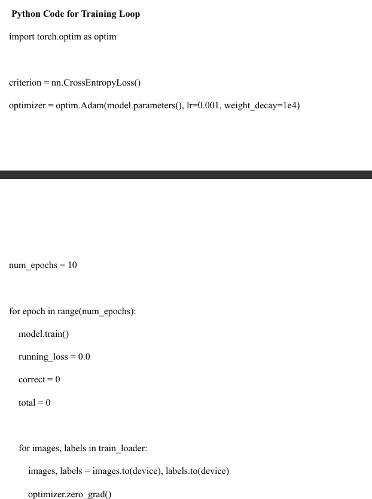
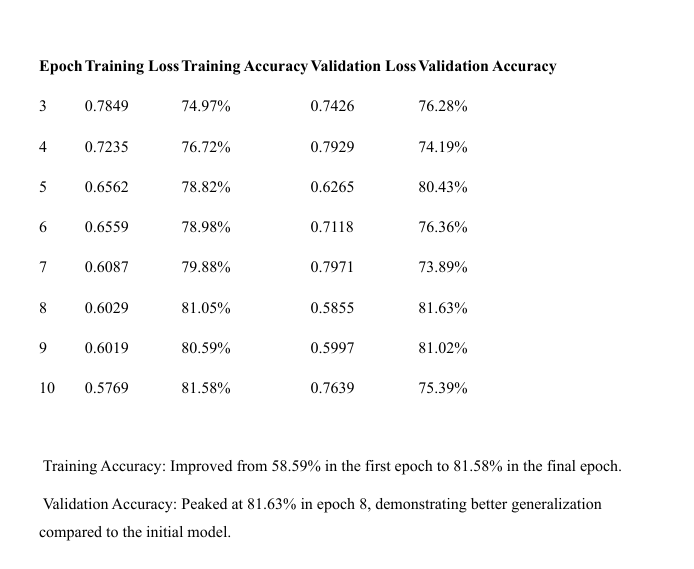
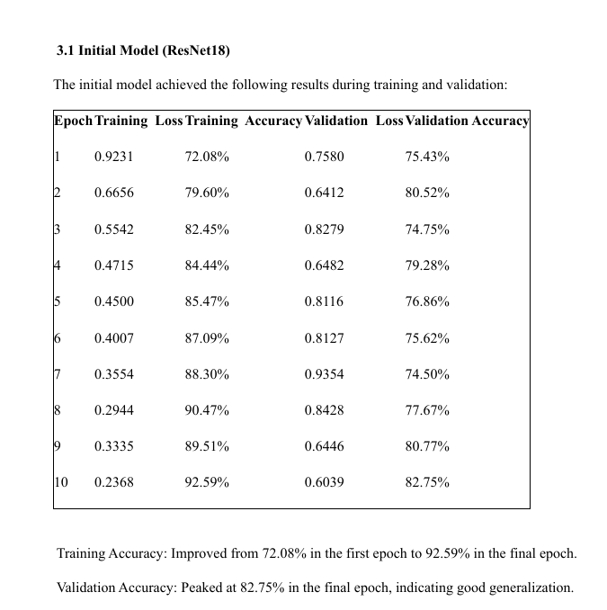

# 🧠 Machine Learning & Reinforcement Learning Projects

This repository contains two core machine learning tasks:

- **Task 1: Image Classification using Deep Learning (ResNet)**
- **Task 2: Gridworld Navigation using Reinforcement Learning (Value Iteration & Q-Learning)**

---

## 📁 Task 1: Image Classification

### 🎯 Objective
Classify images into classes like parachutes, oil boxes, and trucks using pretrained deep learning models. Experimentation focused on improving performance through model choice and data augmentation.

### ⚙️ Methodology

- **Preprocessing**:
  - Resizing to 128×128
  - Data Augmentation: horizontal/vertical flips, rotations, color jitter
  - Normalization using ImageNet stats
- **Models Used**:
  - Initial: `ResNet18`
  - Improved: `ResNet50` with augmentation
- **Loss & Optimizer**:
  - Loss: CrossEntropy
  - Optimizer: Adam (LR = 0.001, weight decay = 1e-4)

### 🧪 Training Results

#### ResNet18
Achieved **92.59% training accuracy** and **82.75% validation accuracy** in 10 epochs.

#### ResNet50 + Augmentation
Achieved **81.58% training accuracy** and **81.63% validation accuracy** in 10 epochs.

### 📊 Sample Results
| Model         | Final Train Acc | Final Val Acc |
|---------------|------------------|----------------|
| ResNet18      | 92.59%           | 82.75%         |
| ResNet50 + DA | 81.58%           | 81.63%         |

### 🖼️ Visual Results

### 📌 Observations
- ResNet50 + Data Augmentation helped generalization but had slight fluctuations in validation accuracy.
- Regularization (weight decay) and augmentations were key to reducing overfitting.

---

## 🧭 Task 2: Reinforcement Learning in GridWorld

### 🎯 Objective
Implement **Value Iteration** and **Q-Learning** to find optimal policies in a grid-based world with walls, obstacles, and a goal.

### ⚙️ Environment Details
- Grid contains:
  - `w`: Wall (invalid, -1000 reward)
  - `o`: Obstacle (-10 penalty)
  - `0`: Free space (-1 penalty per step)
  - `g`: Goal (+100 reward)
- Actions: up, down, left, right

### 🧠 Algorithms

#### 1. Value Iteration
- Model-based
- Computes optimal value function using Bellman updates
- Converges faster and is computationally efficient

#### 2. Q-Learning
- Model-free
- Learns action-value function from exploration
- Takes longer but doesn’t need environment dynamics

### 📊 Comparison Summary

| Algorithm        | Convergence Speed | Model Required | Policy Quality |
|------------------|-------------------|----------------|----------------|
| Value Iteration  | ✅ Fast            | ✅ Yes          | ✅ Optimal      |
| Q-Learning       | 🚧 Slower          | ❌ No           | ✅ Optimal      |

### 📌 Observations
- **Value Iteration** is more efficient for known environments.
- **Q-Learning** offers flexibility and scales better with larger or unknown environments.
- Both achieved comparable policies.

---

## 🔮 Future Work

- **Task 1**:
  - Use learning rate schedulers
  - Try ensemble or transformer-based vision models
- **Task 2**:
  - Extend to Deep Q-Networks (DQN)
  - Integrate stochastic rewards or continuous actions

---
